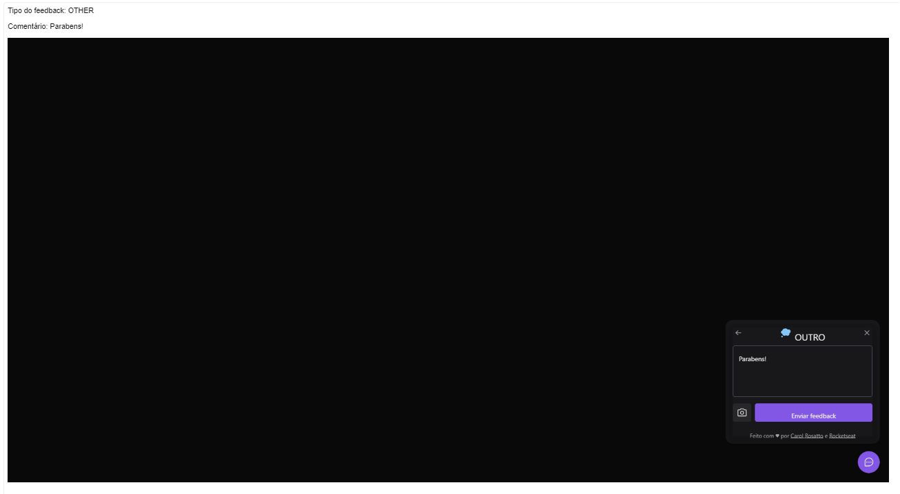

# FeedGet

Aplicação desenvolvida durante o NLW Ignite da Rocketseat

Link para acessar o resultado: [Feedget](https://nlw-return-impulse-1qomktysw-carolrosatto.vercel.app)

## Funcionalidades

- Widget onde o usuário pode enviar feedbacks (alerta de bugs, ideias, ou outros assuntos) através de formulário;
- Tirar um print da tela e que será enviada junto com o feedback;
- O administrador do Widget recebe um e-mail com o feedback e a imagem;
- Pode ser acessado via browser ou mobile. 

## Tecnologias utilizadas

- [TypeScript](https://www.typescriptlang.org)

### Back-end

- [Prisma](https://www.prisma.io)
- [PostgreSQL](https://www.postgresql.org)
- [Railway](railway.app)
- [nodemailer](https://nodemailer.com/about/)
- [jest](https://jestjs.io/pt-BR/)

### Front-end web

- [React JS](https://pt-br.reactjs.org)
- [Vite](https://vitejs.dev)
- [Axios](https://axios-http.com/ptbr/docs/intro)
- [Tailwind CSS](https://tailwindcss.com)
- [Vercel](https://vercel.com)
- [phosphor-react](https://www.npmjs.com/package/phosphor-react)
- [html2canvas](https://html2canvas.hertzen.com)

### Front-end mobile

- [React Native](https://reactnative.dev)
- [Expo](https://expo.dev)
- [react-native-gesture-handler](https://www.npmjs.com/package/react-native-gesture-handler)
- [react-native-svg](https://www.npmjs.com/package/react-native-svg)
- [react-native-view-shot](https://www.npmjs.com/package/react-native-view-shot)
- [gorhom/bottom-sheet](https://github.com/gorhom/react-native-bottom-sheet)
- [phosphor-react-native](https://www.npmjs.com/package/phosphor-react-native)
- [expo-app-loading](https://www.npmjs.com/package/expo-app-loading)
- [expo-status-bar](https://www.npmjs.com/package/expo-status-bar)
- [expo-file-system](https://www.npmjs.com/package/expo-file-system)

## Overview das telas

### Versão mobile

### Versão web

### E-mail recebido pelo administrador

